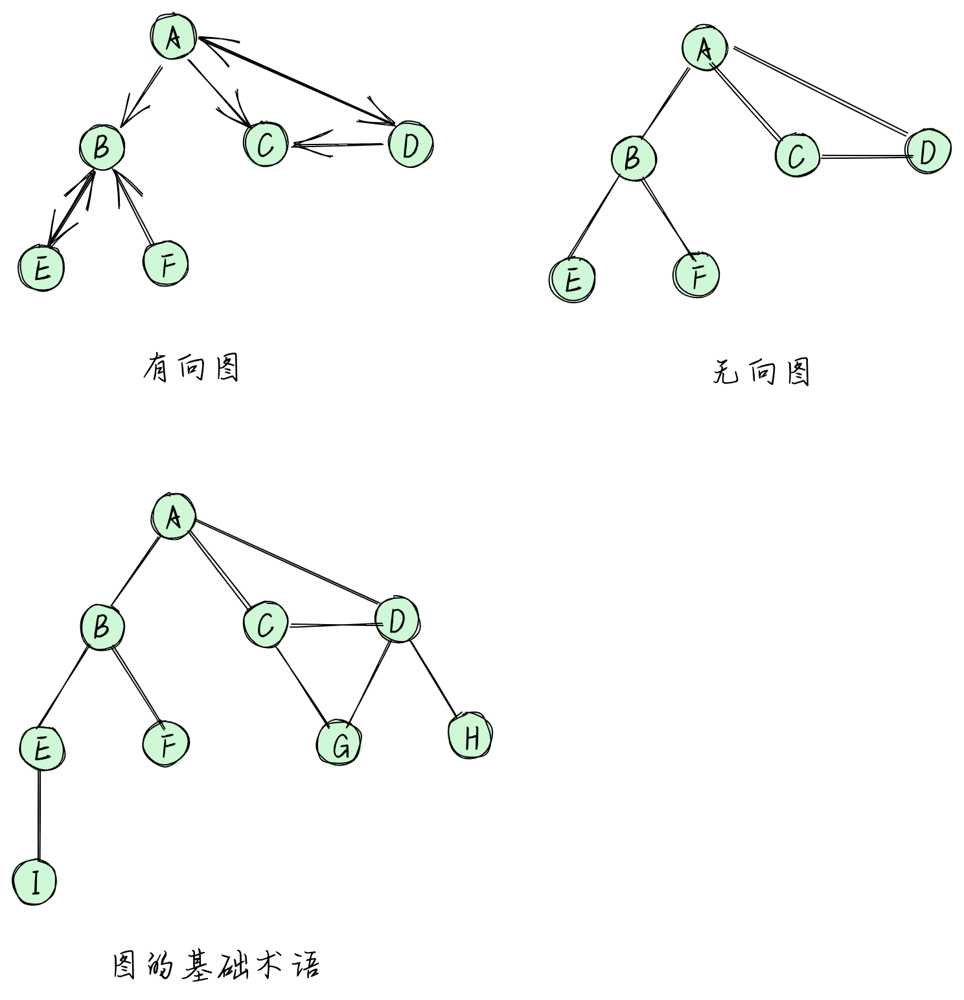
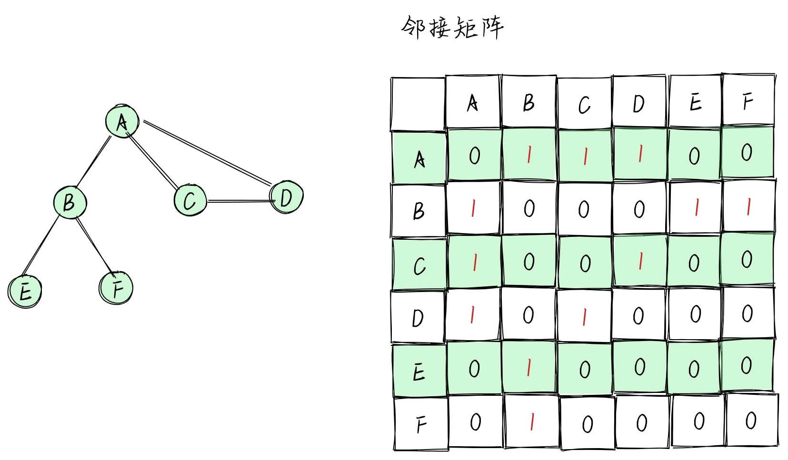
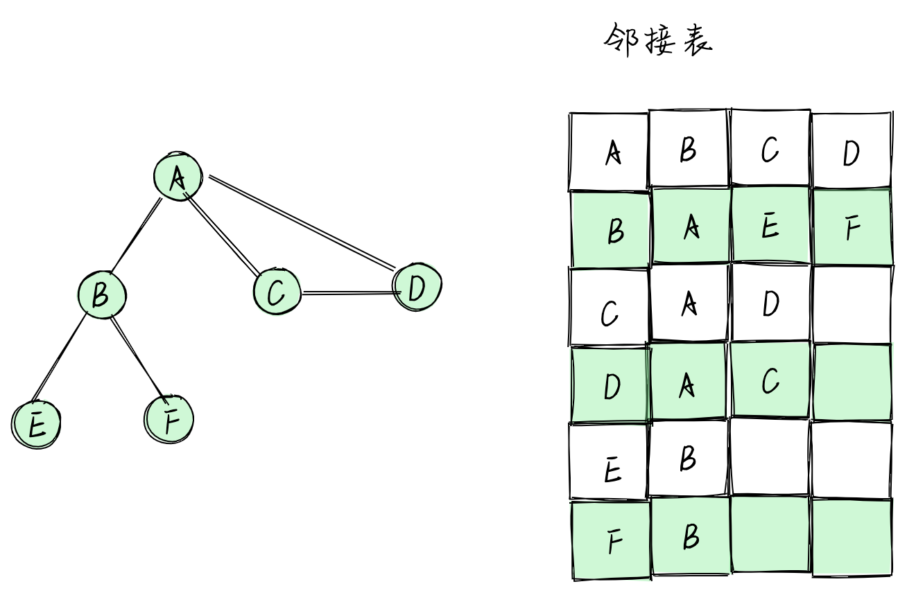
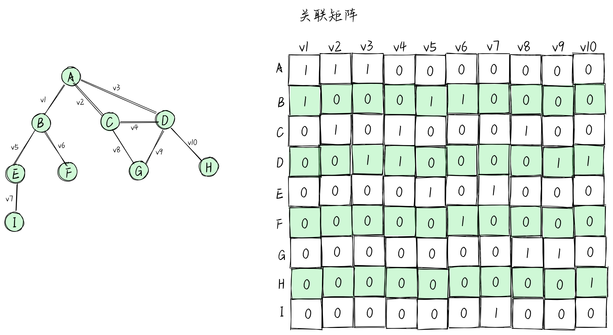
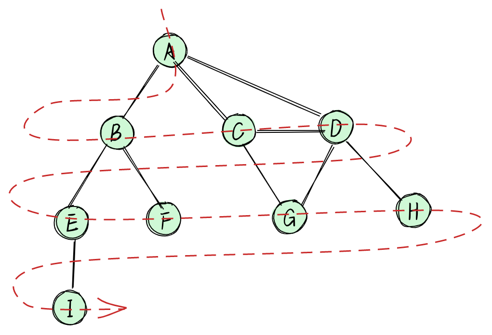
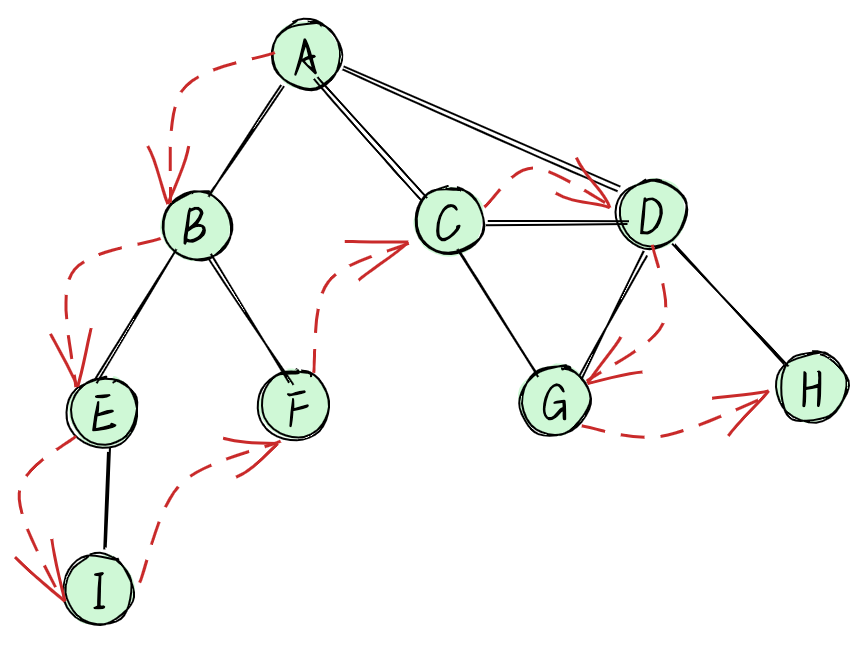
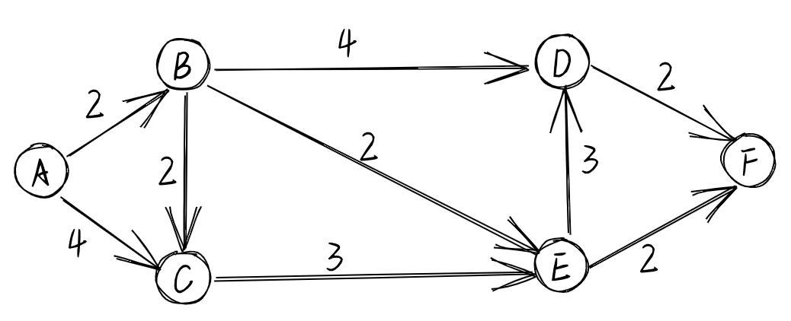

## 图

### 图的定义

> 图是网络结构的抽象模型。图是是一组由边连接的节点（或顶点）
> 一个图 G = (V, E)由以下元素构成
> V: 一组顶点
> E: 一组边，连接 V 中的顶点

**图的分类**

> 一种是有向图，另一种是无向图
> 
> 图的基础术语
> 1、由一条边连接在一起的顶点称为相邻顶点。比如 A 和 B 是相邻的，A 和 D 是相邻的，A 和 E 不是相邻的。
> 2、一个顶点的度是其相邻顶点的数量。比如：A 的度是 3，B 的度是 2。
> 3、路径是顶点 V1，V2...,Vk 的一个连续序列，其中 Vi 和 Vi+1 是相邻的。以上其中包含路径 ABEI 和 ACDG。
> 简单路径要求不包含重复的顶点。比如，ADG 是一条简单路径。除去最后一个顶点（因为它和第一个顶点是同一个顶点），环也是一个简单路径，比如 ADCA(最后一个顶点重新回到了 A)，要是没有的话就是一个无环

### 图的表示

**邻接矩阵**

> 图最常见的实现是邻接矩阵。每个节点都和一个整数相关联，该整数将作为数组的索引。用一个二维数组来表示顶点之间的连接。如果索引为 i 的节点和索引为 j 的节点相邻，则 array[i][j]=== 1，否则 array[i][j] === 0。
> 
> 缺点：
> 1、非常浪费计算机内存
> 2、添加和删除点非常麻烦

**邻接表**

> 邻接表的动态数据结构也可以用来表示图。邻接表由图中每个顶点的相邻顶
> 点列表所组成。存在好几种方式来表示这种数据结构。可以用列表（数组）、链表，甚至是散列表或是字典来表示相邻顶点列表。
> 

**关联矩阵**

> 用关联矩阵来表示图。在关联矩阵中，矩阵的行表示顶点，列表示边。使用二维数组来表示两者之间的连通性，如果顶点 v 是边 e 的入射点，则 array[v][e] === 1；否则，array[v][e] === 0。
> 

### 图的现实

**[`Graph Demo`](./graph.js)**

### 图的遍历

> 图遍历可以用来寻找特定的顶点或寻找两个顶点之间的路径，检查图是否连通，检查图是否含有环等。

> 图遍历算法的思想是必须追踪每个第一次访问的节点，并且追踪有哪些节点还没有被完全探索。对于两种图遍历算法，都需要明确指出第一个被访问的顶点。
> 完全探索一个顶点要求查看该顶点的每一条边。对于每一条边所连接的没有被访问过的顶点，将其标注为被发现的，并将其加进待访问顶点列表中。

> 为了保证算法的效率，务必访问每个顶点至多两次。连通图中每条边和顶点都会被访问到。
> 广度优先搜索算法和深度优先搜索算法基本上是相同的，只有一点不同，那就是待访问顶点列表的数据结构。

**广度优先搜索**

> 算法口诀
> 1、访问根节点
> 2、对根节点的`没有访问过的相邻节点`挨个进行深度优先遍历

**[`BreadthFirstSearch Demo`](./breadth-first-search.js)**

**深度优先搜索**

> 算法口诀
> 1、把根节点入队
> 2、把队头出队并访问
> 3、把队头的`没有访问过的相邻节点`入队
> 4、重复 2，3 步，直到队列为空

**[`DepthFirstSearch Demo`](./depth-first-search.js)**

### 最短路径算法

**Dijkstra 算法**

> Dijkstra 算法是一种从单一源到所有其他源的最短路径的贪心算法，这意味着我们可以用它来计算从图的一个顶点到其余各顶点的最短路径。

**[`Dijkstra Demo`](./dijkstra.js)**

**Floyd-Warshall 算法**

> Floyd-Warshall 算法是一种计算图中所有最短路径的动态规划算法

**[`FloydWarshall Demo`](./floyd-warshall.js)**

### 最小生成树（MST）

**Prim 算法**

> Prim 算法是一种求解加权无向联通图的 MST 问题的贪心算法，它能找出某种边的子集，使其构成的树包含图中所有顶点，且边的权值之和最小。

**[`Prim Demo`](./prim.js)**

**Kruskal 算法**

> 与 Prim 算法一样，是一种求解加权无向联通图的 MST 问题的贪心算法

**[`Kruskal Demo`](./kruskal.js)**
