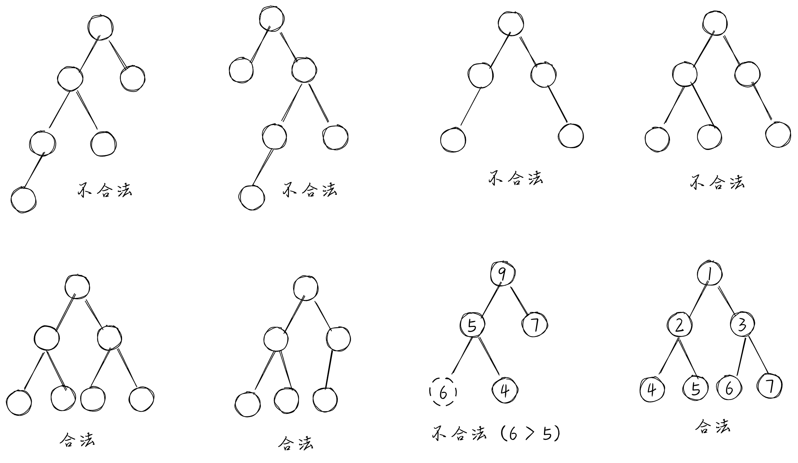
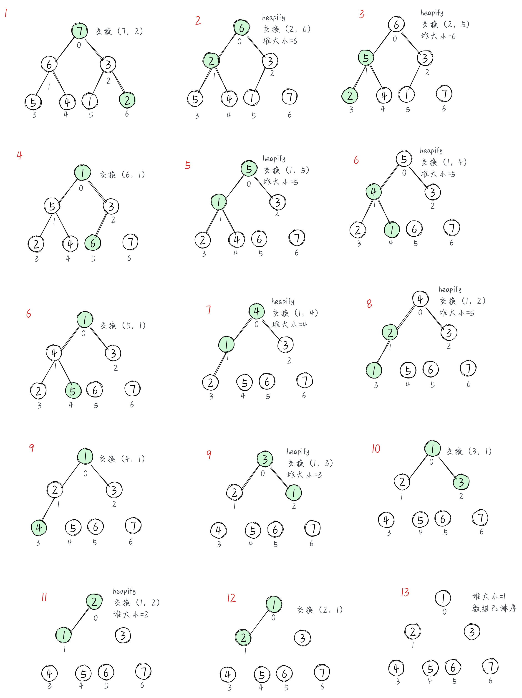

## 二叉堆和堆排序

### 二叉堆

**二叉堆的定义**

> 二叉堆是一种特殊的二叉树，有以下两个特性
> 1、它是一颗完全二叉树，表示树的每一层都有左侧和右侧子节点（除了叶节点），并且最后一层的叶节点都尽可能的是左侧子节点，这叫做结构特性。
> 2、二叉堆不是最小堆就是最大堆。最小堆允许你快速导出树的最小值，最大堆则相反。所有节点都 >= 或 <= 每个它的子节点。这叫做堆特性。

如下图：合法与不合法的堆



> 尽管二叉堆是二叉树，但其不一定是二叉搜索树（BST）。在二叉堆中，每个子节点都要 >= 父节点（最小堆）或 <= 父节点（最大堆）。但在二叉搜索树中，左侧子节点总比父节点小，右侧子节点也总比父节点大。

**二叉堆的实现**

**[`Heap Demo`](./heap.js)**

> 实现了以下功能

```
minHeap() 创建最小堆
maxHeap() 创建最大堆
```

### 堆排序

**堆排序的步骤**

- 用数组创建一个最大堆用于源数据
- 在创建最大堆之后，最大的值会被储存在堆的第一个位置，然后把这个值替换成堆的最后一个值，并将堆的大小 -1
- 将堆的根节点下移并重复步骤 2 直到堆的大小为 1

**堆排序的实现**

**[`HeapSort Demo`](./heap-sort.js)**

**图解堆排序算法**


