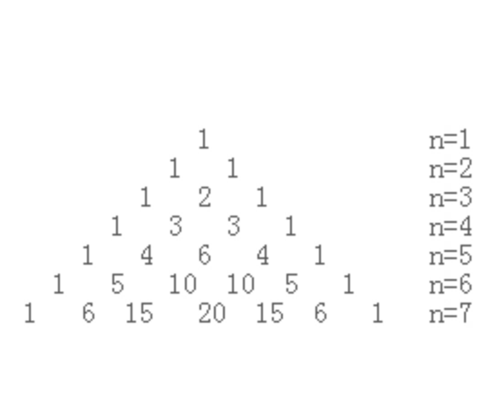

## 队列和双端队列

### 队列

**队列的定义**

> 队列是遵循`先进先出（FIFO，也称为先来先服务）`原则的一组有序的项。队列在尾部添加新元素，并从顶部移除元素。最新添加的的元素必须排在队列的尾部。

> 队列是一种特殊的线性表，特殊之处在于它只允许在表的[前端]进行删除操作，而在表的[后端]进行插入操作，和栈一样，队列是一种操作受限制的线性表。进行插入操作的端称为队尾，进行删除操作的端称为队首。队列的数据元素又称为队列元素。在队列中插入一个队列元素称为入队，从队列中删除一个队列元素称为出队。

**队列的工作原理**


**队列的实现**

> 从数据存储的角度看，实现队列有两种方式，一种是以数组做基础，一种是以链表做基础，数组是最简单的实现方式。

**[`Queue - Demo`](./queue.js)**

> 实现了以下功能

```
enqueue(element(s)) 向队列尾部添加一个（或多个）新的项
dequeue() 移除队列的第一项（即排在队列最前面的项），并返回被移除的元素
peek()/front() 返回队列中的第一个元素 - 最先被添加，也将是最先被移除的元素。队列不做任何变动
isEmpty() 如果队列里没有任何元素就返回true，否则返回false
size() 返回队列里元素的个数
clear() 移除队列里所有元素
```

### 双端队列

**双端队列的定义**

> 双端队列（deque，或称 double-ended queue）是一种允许我们同时从前端和后端添加或者移除元素的特殊队列

> 双端队列在生活中的例子：去电影院看电影，在排队进场【 x(n), x(n-1) ... x2, x1】，结果 x(n)要回去加班了然后 x(n)就推出了这个队伍，然后新来了一个 y1 排了进去【 y1, x(n-1) ... x2, x1】,另外 x1 的也是如此，即进场和插队的。在计算机科学中双端队列最常见的应用就是 存储一系列的撤销操作。双端队列同时遵循`先进先出、后进先出`的原则

**队列的工作原理**


**[`Deque Demo`](./deque.js)**

> 实现了以下功能

```
addFront(element) 该方法在双端队列前端添加新的元素
addBack(element) 该方法在双端队列后端添加新的元素（实现方法和Queue类中的enqueue方法相同）
removeFront() 该方法会从双端队列前端移除第一个元素（实现方法和Queue类中的dequeue方法相同）
removeBack() 该方法会从双端队列后端移除第一个元素（实现方法和Queue类中的pop方法一样）
peekFront() 该方法返回双端队列前端的第一个元素（实现方法和Queue类的中的peek方法一样）
peekBack() 该方法返回双端队列后端的第一个元素（实现方法和Stack类中的peek方法一样）
```

### 拓展

**击鼓传花游戏**

> 一群小孩围成一个圆圈，把花尽快的传给旁边的人。某一时刻传花停止，这时花在谁手里，谁就退出圆圈结束游戏。重复此过程，直到剩下最后一个孩子，即为胜者。

**回文检查器**

> 回文是正反都能读通的单词，词组，数或一些列字符的序列，例如 madam 与 racecar

**约瑟夫环问题**
有一个数组存放了 100 个数据 0-99，要求每隔两个数删除一个数，到末尾时再循环至开头继续进行，求最后一个被删除的数字。

> 比如说：有十个数字：0，1，2，3，4，5，6，8，9，每隔两个数删除一个数，就是 2 5 8 删除，如果只是从 0 到 99 每两个数删除一个数，其实挺简单的，但是我们还得考虑到末尾的时候还有再重头开始，还得考虑删除掉的元素从数组中删除。那我们如果队列的话，就比较简单了

**斐波那契数列**

> 斐波那契数列（Fibonacci sequence），又称黄金分割数列、因数学家列昂纳多·斐波那契（Leonardoda Fibonacci）以兔子繁殖为例子而引入，故又称为“兔子数列”，指的是这样一个数列：1、1、2、3、5、8、13、21、34、……这个数列从第 3 项开始，每一项都等于前两项之和。在数学上，斐波纳契数列以如下被以递归的方法定义：F(1)=1，F(2)=1, F(n)=F(n-1)+F(n-2)（n>=3，n∈N\*）

**杨辉三角**

> 计算的方式：f[i][j] = f[i-1][j-1] + f[i-1][j], i 代表行数，j 代表一行的第几个数，如果 j= 0 或者 j = i ,则 f[i][j] = 1。
> 
