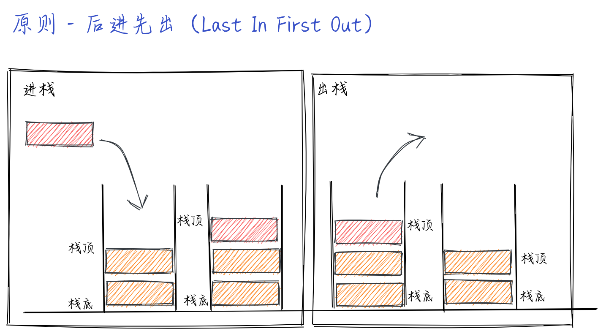

## 栈

**栈的定义**

> 栈是一种遵从`后进先出（LIFO）`原则的有序集合。新添加或待删除的元素都保存在栈的同一端，称作栈顶，另一端就叫栈底。在栈里，新元素都靠近栈顶，就元素都接近栈底。

**栈的工作原理**



**栈的实现**

> 从数据存储的角度看，实现栈有两种方式，一个是以数组做基础，一种是以链表做基础，数组是最简单的实现方式。栈的基本操作包括：创建栈、出栈、入栈、获取栈顶元素、获取栈的大小、清空栈。

**[`demo - array`](./stack-array.js)**  
**[`demo - object`](./stack.js)**

> 实现了以下功能

```
push(element(s)) 添加一个（或几个）新元素到栈顶
pop() 移除栈顶的元素，同时返回被移除的元素
peek() 返回栈顶的元素，不对栈做任何修改
isEmpty() 如果栈里没有任何元素就返回true，否则返回false
clear() 移除栈里所有元素
size() 返回栈里元素的个数
```

**栈的安全性**

> 因为我们定义的 Stack 类，没有对数据做任何保护机制，所以数据不安全

解决方案：

- 使用私有变量（如：this.\_items = []） // js 中使用下划线命名约定来标记一个属性为私有属性
- 使用 Symbol
- 使用 WeakMap

**[`demo - symbol`](./stack-symbol.js)**  
**[`demo - weakMap`](./stack-weakMap.js)**
